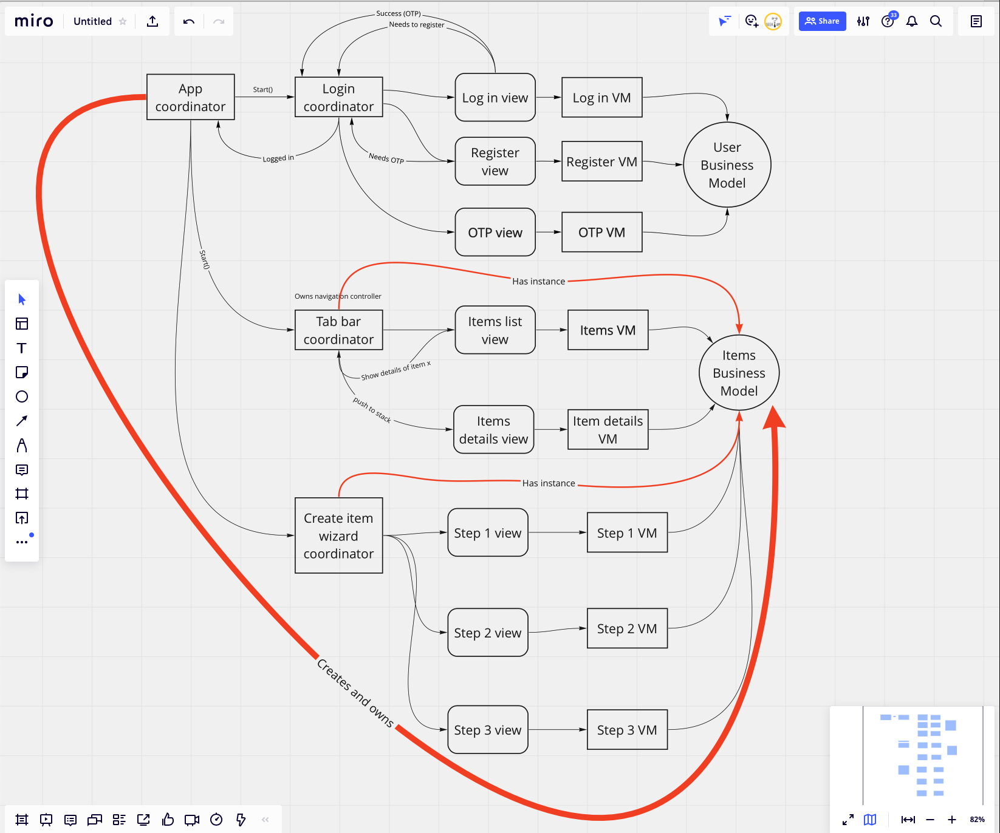

iOS MVVM-C Template
===================

A general-purpose skeleton application
--------------------------------------

This project is a template using the MVVM-C architecture. This project contains
Log in view, OTP view, registration view, and a tab bar with multiple views
Profile, list of items which upon tap an item details view. We also have a
wizard (form) for creating a support request

 

Every business part has it own business model

V: View

VM: View model

BM: Business model

C: Coordinator

 

C -\> V -\> VM -\> BM

 

So typically App delegate owns an App coordinator which owns a UIWindow

Check the rest in the architecture class diagram

 

 
